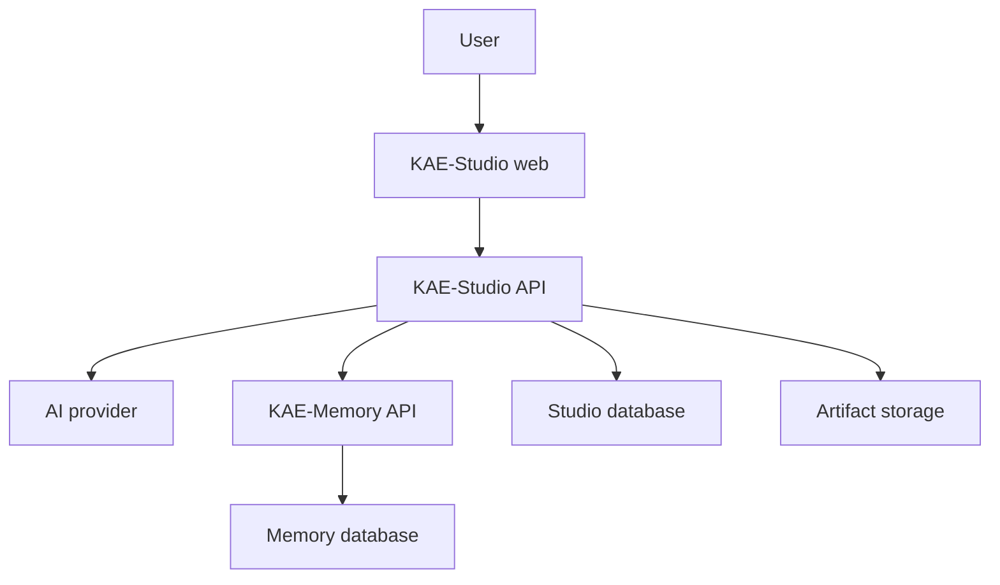

# System Boundary

Status: approved direction.

## Component relationship

## KAE-Studio owns

- Product projects and workspace preferences.
- Conversation sessions and ordered messages.
- Interview orchestration and user-facing phase/state.
- AI-provider adapters and Studio-specific prompts.
- Requirements, architecture, plan, and health projections shown to users.
- Deliverable generation requests, manifests, and export links.
- Product authentication/authorization when added.
- User-facing failure, retry, and resume behavior.

## KAE-Memory owns

- Immutable evidence accepted from clients.
- Extracted knowledge items and types.
- Knowledge versions, revisions, relationships, and status.
- Provenance from evidence to knowledge.
- Human or authorized confirmation semantics.
- Knowledge-area assignments and readiness calculation.
- Review findings and contradiction/gap detection.
- Semantic retrieval and context assembly.
- Durable memory-agent runs and their state.

## Integration rule

Studio communicates with Memory only through a versioned client/API. The client belongs in Studio, but Memory remains authoritative for memory semantics.

The boundary must support:

- idempotent evidence submission;
- asynchronous processing where needed;
- retrieval scoped by project/tenant;
- explicit memory revision identifiers;
- clear pending, succeeded, partially processed, and failed states;
- traceability references usable in artifacts;
- retry without duplicate evidence.

## Identity

Use UUIDs generated at the owning service.

Studio owns `studio_project_id`, `conversation_id`, `message_id`, and `artifact_id`. Memory owns `memory_project_id`, `evidence_id`, `knowledge_id`, `revision_id`, and `run_id`.

Studio stores the mapping between `studio_project_id` and `memory_project_id`. Client-origin identifiers such as `message_id` are sent as idempotency/source references, not treated as Memory primary keys.

## Current KAE-Memory UI

The existing Discovery, Knowledge, Readiness, Review, Runs, and Blueprint screens are not the intended Studio navigation.

They remain valuable as:

- memory diagnostics;
- API and persistence verification;
- provenance inspection;
- run debugging;
- readiness/review validation;
- administrator or power-user tools.

They should stay with KAE-Memory until a deliberate migration decision exists. Studio should not copy them as its starting UI.

## Deployment

For local development, both services may run on the same machine. For the hackathon deployment, both may use the same CockroachDB cluster and shared infrastructure account. These conveniences do not remove the API or ownership boundary.

