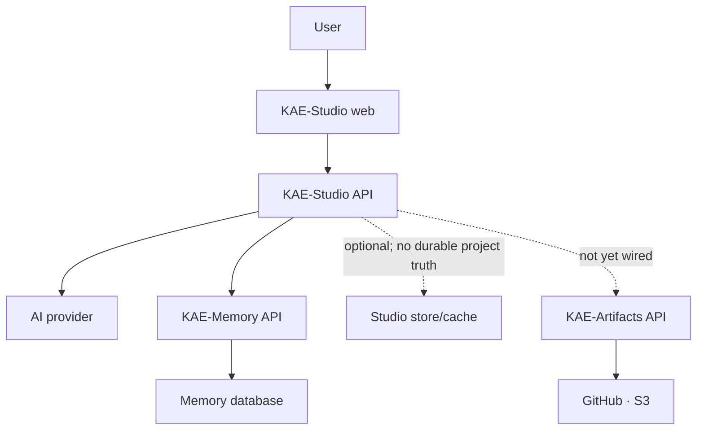

# System Boundary

Status: approved direction. Ownership lists corrected by ADR-0006, and again by the extraction of artifact generation into KAE-Artifacts.

## Component relationship

## KAE-Studio owns

- Interface state: layout, panels, preferences, unsent composer drafts.
- AI-provider selection, credentials handling, and Studio-specific prompts.
- Interview *presentation*: which type is active, how a question is phrased and shown.
- Requirements, module, architecture, plan, and health projections shown to users — caches, rebuildable from a Memory revision.
- Delivery-target configuration, and the surfaces where a person edits an artifact plan, reads a preview, and approves it.
- Product authentication/authorization when added.
- User-facing failure, retry, and resume behavior, including transient send buffers.

**Studio does not own the durable conversation.** Projects, sessions, and ordered messages are KAE-Memory's (ADR-0006). Studio submits messages through the Memory API and reads them back.

## KAE-Memory owns

- Projects, sessions, and ordered user and assistant messages.
- Immutable evidence accepted from clients.
- Extracted knowledge items and types.
- Knowledge versions, revisions, relationships, and status.
- Provenance from evidence to knowledge.
- Human or authorized confirmation semantics.
- Knowledge-area assignments and readiness calculation.
- Review findings and contradiction/gap detection.
- Synthesized-object revisions, evidence bindings, reconciliation events, and Attention.
- The versioned project-state manifest: a logical projection over model objects,
  evidence, authority, currency, conflict, and completeness.
- Semantic retrieval and context assembly.
- Durable memory-agent runs and their state.

## KAE-Artifacts owns

Extracted from Studio's delivery subsystem into its own component, which is implemented and callable over HTTP:

- Artifact plans, generation, validation, and packaging.
- Destination-aware previews, and the approval evidence that binds one.
- Publisher implementations and provider concurrency handling.
- Publication provenance: which input and which bytes produced which destination state.

It imports no KAE-Memory type. Its input is a provider-neutral structure, and its own edge adapter converts an assembled Memory context into one — which is what keeps a Memory schema change from becoming an Artifacts change.

**Studio does not call it yet.** The remaining work is a Studio surface for plan → preview → approval → publish, and an HTTP client adapter for GitHub or S3 inside KAE-Artifacts. Neither is done, and the dotted line in the diagram above says so deliberately.

## Integration rule

Studio communicates with Memory only through a versioned client/API. The client belongs in Studio, but Memory remains authoritative for memory semantics.

The existing Studio `/projection` endpoint is a legacy workspace aggregation and must not
be confused with the Memory-owned project-state manifest. See
`EPISTEMIC_PRESENTATION_MODEL.md`.

The same applies to KAE-Artifacts: a versioned client in Studio, and Artifacts authoritative for generation and publication semantics. In particular, Studio must not reimplement the approval check — an approval is evidence held by KAE-Artifacts, and a Studio-side "the user clicked approve" boolean would be exactly the thing that model was built to replace.

The boundary must support:

- idempotent evidence submission;
- asynchronous processing where needed;
- retrieval scoped by project/tenant;
- explicit memory revision identifiers;
- clear pending, succeeded, partially processed, and failed states;
- traceability references usable in artifacts;
- retry without duplicate evidence.

## Identity

Use UUIDs generated at the owning service.

KAE-Artifacts owns `plan_id`, `artifact_id`, `package_id`, `preview_id`, `approval_id`, and `publication_id`. Studio owns its delivery-target references. Memory owns `project_id`, `session_id`, `message_id`, `evidence_id`, `knowledge_id`, `revision_id`, and `run_id`.

Under ADR-0006 there is no separate `studio_project_id` to map: a Studio project *is* a Memory project. Studio may hold a local reference for routing and preferences, but the identity is Memory's. Client-supplied idempotency keys remain source references, not Memory primary keys.

## Current KAE-Memory UI

The existing Discovery, Knowledge, Readiness, Review, Runs, and Blueprint screens are not the intended Studio navigation.

They remain valuable as:

- memory diagnostics;
- API and persistence verification;
- provenance inspection;
- run debugging;
- readiness/review validation;
- administrator or power-user tools.

They should stay with KAE-Memory until a deliberate migration decision exists. Studio should not copy them as its starting UI.

## Deployment

For local development, both services may run on the same machine. For the hackathon deployment, both may use the same CockroachDB cluster and shared infrastructure account. These conveniences do not remove the API or ownership boundary.
