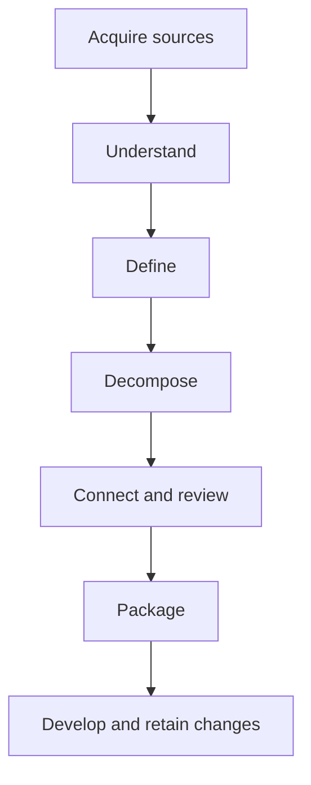
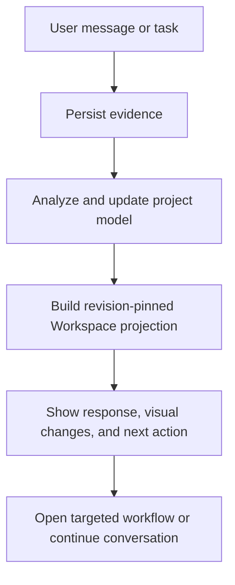

# Workspace Visual Intelligence and Content Design Proposal

Status: proposed product-design direction for review and phased implementation.

Scope: the KAE-Studio **Workspace** route. This document refines, but does not replace, `UI_GENERATION_CONTEXT.md`, `USER_WORKFLOW.md`, or the project-model contracts.

## 1. Executive assessment

The current Workspace has improved into a credible planning shell: conversation is central, project navigation is persistent, and structured knowledge is visible. Its next problem is not lack of information. It is that too much information is presented with weak hierarchy, while some displayed states disagree.

The Workspace should become a **visual project navigator with a conversation surface**, not a transcript surrounded by status lists.

It must answer four questions within seconds:

1. Where is this project in its planning journey?
2. What became known or changed from the latest interaction?
3. What is blocking progress?
4. What is the best next action, and where will it take me?

Graphs, progress indicators, matrices, and color must be projections of the same revision-pinned project state. If the source is missing, stale, proposed, or contradictory, the visualization must say so.

## 2. Evidence from the deployed Workspace

Review of the deployed Studio identified these issues:

- The right panel is a long checklist of discovery topics and open items rather than a decision-support surface.
- Small grey progress bars and repeated “missing” labels do not communicate priority, dependency, or sequence.
- “Reviews,” “open decisions,” “open questions,” “gaps,” and “proposed knowledge” appear with conflicting counts or unclear relationships.
- Current Understanding, Architecture, Plan, Modules, and Deliverables can describe incompatible project states.
- Conversation asks for repository details manually instead of launching the repository-acquisition workflow.
- Empty or unavailable areas often redirect to Workspace without offering the exact action required to unlock them.
- The initial “Checking Studio…” gate lacks meaningful stage, timeout, and recovery information.
- The desktop layout is information-heavy; simply shrinking it would not create a usable mobile view.

These are truth-boundary and workflow-design problems before they are styling problems.

## 3. Design principles

### 3.1 Truth before polish

Every visual component must declare:

- the project identifier;
- source revision;
- computed or supplied timestamp;
- freshness state when not current;
- confidence or confirmation state when relevant;
- unavailable state when authoritative data does not exist.

Do not render examples, fixtures, inferred modules, or placeholder workflow nodes as current project facts.

### 3.2 One project state, many projections

Conversation, status graphics, matrices, and structured pages must project from the same normalized Workspace model. The browser must not independently recompute readiness or reinterpret Memory status.

### 3.3 Visuals must lead to action

A graphic earns space only if it helps the user:

- understand progress;
- locate a blocker;
- compare modules;
- follow a dependency;
- inspect a change;
- launch the relevant workflow.

Every selectable visual element must have a defined drill-down or action.

### 3.4 Status vocabulary is shared

Use these distinct concepts consistently:

| Concept | Workspace meaning | Primary action |
| --- | --- | --- |
| Open question | Missing information that can be answered | Answer or defer |
| Proposed knowledge | AI-derived claim awaiting review | Confirm, edit, or reject |
| Gap | Required coverage is insufficient | Start targeted discovery |
| Open decision | Choice between meaningful alternatives | Compare and decide |
| Contradiction | Two incompatible claims exist | Resolve with evidence |
| Unverified requirement | Requirement lacks confirmation or proof | Review or add verification |
| Blocker | An item preventing a downstream stage | Resolve blocking item |

Counts must not be relabeled into another concept for convenience.

### 3.5 Color is reinforcement, never the only signal

Every state uses label, icon or shape, and accessible color. Avoid turning all incomplete work red; early discovery is expected, not failure.

## 4. Proposed Workspace information architecture

The desktop Workspace retains three regions, but their responsibilities become sharper.

| Region | Responsibility | Content |
| --- | --- | --- |
| Left rail | Location and project scope | Project switcher, stage-aware navigation, restrained badges |
| Main surface | Current work | Objective header, conversation, structured response, composer |
| Navigator | State and next action | Journey map, recommended actions, blockers, recent changes |
| Status strip | Technical trust | Save, Memory sync, revision, provider degradation |

### 4.1 Workspace header

Show:

- project name;
- current planning stage in human language;
- session objective;
- source/freshness indicator;
- one primary next action.

Example:

> Requirements forming · Existing-project acquisition incomplete  
> Next: Connect the repository so KAE can analyze current code and context.

Avoid a generic percentage as the headline.

### 4.2 Main conversation surface

Conversation remains primary, but assistant turns can contain product-aware cards:

- **Understanding update** — what changed, with proposed/confirmed state;
- **Focused question** — one primary question, why it matters, answer/defer;
- **Workflow launch** — opens repository intake, decision comparison, review queue, or another appropriate surface;
- **Conflict card** — competing claims with source links;
- **Completion card** — what was completed and which project views changed.

When a user response implies a task, launch or offer the relevant workflow instead of turning its fields into multiple chat questions.

### 4.3 Right-side Project Navigator

Replace the long discovery checklist with four compact, ordered blocks:

1. **Journey**
2. **Recommended next actions**
3. **Blocking and awaiting attention**
4. **Changed in this session**

Each block shows a summary first and reveals detail on demand.

## 5. Graphical components

### 5.1 Project Journey Map

Purpose: show sequence, current stage, blocked stages, and available transitions.



Visual states:

- Complete: required exit conditions met.
- Active: current objective.
- Available: can start without a blocker.
- Blocked: names the blocking decision or gap.
- Not started: neutral, not erroneous.
- Outdated: previously complete but affected by a later revision.

Selecting a stage opens its summary and the best relevant action. It must never imply strict linearity where work can overlap.

### 5.2 Readiness-by-area graphic

Use a compact segmented bar or small radar only when the dimensions share a meaningful scale. Default to readable topic rows for precision:

| Area | State | Evidence | Action |
| --- | --- | ---: | --- |
| Problem and value | Strong | 6 confirmed | Inspect |
| Users and roles | Forming | 3 proposed | Review |
| Repository context | Blocked | No source connected | Connect |
| Acceptance | Not started | 0 | Start interview |

Readiness is supplied by Memory. Studio translates it into user language without altering the score.

### 5.3 Module Status Map

Use once module proposals exist. Each module is a selectable card/node showing:

- module name and status;
- readiness band;
- blocking-item count;
- dependency warning;
- changed/outdated indicator.

Color groups modules by state, not arbitrary decorative categories. A graph view is appropriate for dependencies; a grid view is better for comparison. Provide both only after the underlying edges are reliable.

### 5.4 Dependency and Workflow diagrams

Render diagrams from typed relationships:

- `depends_on` for module/build sequencing;
- `realized_by` for workflows to modules/screens;
- `blocked_by` for blocking decisions;
- `satisfies`, `implemented_by`, and `verified_by` for traceability.

Requirements:

- distinguish runtime dependency from delivery order;
- detect and visibly call out cycles;
- support keyboard selection and a text/table alternative;
- reveal source and revision in the detail drawer;
- do not invent missing edges to make the diagram attractive.

### 5.5 Decision and Review Matrix

Use a matrix when the user must compare categories, not as the default review list.

Suggested axes:

- rows: modules or planning areas;
- columns: gaps, decisions, proposed items, contradictions, verification;
- cell: count plus severity;
- selection: filtered Reviews view.

This provides a compact dashboard while preserving exact vocabulary.

### 5.6 Completion statistics

Show statistics only with a denominator and meaning:

- `7 of 10 planning areas have sufficient evidence`;
- `3 of 8 proposed modules accepted`;
- `12 of 17 requirements confirmed`;
- `4 requirements still lack acceptance tests`.

Avoid ambiguous “72% complete.” Planning completeness, confirmation coverage, and implementation progress are different measures.

### 5.7 Recent Change Pulse

After each processed turn, show a small change summary:

- 2 requirements proposed;
- 1 assumption superseded;
- repository acquisition still blocked;
- Architecture view now available.

The summary links to affected entities. It should disappear into session history rather than remain permanent clutter.

## 6. Recommended Next Action engine

The Workspace should rank no more than three actions. Each recommendation contains:

- action label;
- why it matters now;
- what it unlocks;
- estimated interaction type, not a fake duration;
- destination;
- blocking/non-blocking marker.

Example:

> **Connect existing repository**  
> KAE cannot establish the current architecture or modules from conversation alone.  
> Unlocks: repository summary, module proposal, evidence-backed gaps.  
> Action: Open Sources & Outputs.

Priority should derive from explicit dependency and readiness rules, not an unconstrained LLM suggestion.

## 7. Content rules

### 7.1 Current Understanding

Keep this compact and revision-aware:

- problem/value;
- primary users;
- current scope;
- core workflow;
- material constraint.

Show no more than five items. Link to Project Definition for the full model. Mark each item proposed, confirmed, contested, or stale without exposing raw storage vocabulary unless the user opens trace details.

### 7.2 Questions

Aggregate implementation-mechanics questions into tasks. For example, replace several questions about repository identity, format, and location with:

> Connect the existing repository and choose what KAE should analyze.

The acquisition workflow can collect provider, URL, branch, credentials, inclusion policy, and verification.

### 7.3 Empty and unavailable states

Every empty state must explain:

- what belongs here;
- why it is empty;
- the exact prerequisite;
- one action to satisfy it.

Never send the user back to Workspace without preserving which workflow needs to start.

### 7.4 Technical details

Provider identifiers, schema versions, model names, revision hashes, and raw response details belong in a trust/diagnostic disclosure. Ordinary users should see operational language such as “Saved,” “Awaiting analysis,” or “Memory unavailable.”

## 8. Themes and responsive views

### 8.1 Theme tokens

Implement semantic tokens rather than page-specific colors:

- surfaces and elevation;
- text hierarchy;
- interactive accent;
- confirmed/success;
- proposed/information;
- warning/deferred;
- blocking/error;
- contested;
- outdated;
- focus ring;
- graph node, edge, and selection states.

Light and dark themes must preserve the same semantic meaning and meet contrast requirements. Store user preference, honor system preference initially, and avoid a flash of the wrong theme.

### 8.2 Desktop

- Persistent left rail.
- Conversation receives the largest width.
- Navigator is collapsible and width-bounded.
- Graphs open in an expandable canvas or dedicated view rather than squeezing chat.

### 8.3 Tablet

- Compact/collapsible navigation.
- Project Navigator becomes a drawer.
- Header retains stage and next action.
- Matrices may switch to scrollable grouped cards.

### 8.4 Mobile

Mobile is a purpose-specific view, not compressed desktop:

- conversation and current objective first;
- bottom composer remains usable above the keyboard;
- top stage chip opens Journey sheet;
- “Next action” remains visible but compact;
- navigation and Project Navigator use separate sheets;
- graphs default to ranked lists/cards with an optional full-screen graph;
- no three-column layout;
- no critical interaction that requires hover.

### 8.5 Future role-oriented views

After core correctness:

- **Guided view** — first-time/stalled users; one next action and simplified terminology.
- **Engineering view** — denser traceability, dependencies, IDs, and revisions.
- **Stakeholder view** — outcomes, decisions, risks, milestones, and deliverable readiness.
- **Presentation view** — read-only project narrative for demos/reviews.

These are projections and density presets, not separate sources of truth.

## 9. Loading, stale, and degraded states

Replace the single “Checking Studio…” gate with staged, honest feedback:

1. Loading application shell.
2. Reaching Studio backend.
3. Loading project briefing.
4. Checking Memory revision.

After a reasonable timeout, show retry and diagnostic disclosure. Cache the shell and last safe project summary where appropriate, clearly labeled as potentially stale.

Distinguish:

- Studio backend unavailable;
- Memory unavailable;
- provider unavailable;
- project not found/unauthorized;
- analysis pending;
- stale projection.

Never replace missing current data with fixture content.

## 10. Suggested frontend projection contract

A product-oriented model can keep visuals consistent:

```ts
type WorkspaceProjection = {
  projectId: string
  projectRevision: string
  generatedAt: string
  freshness: "current" | "stale" | "pending" | "unavailable"
  stage: JourneyStage
  sessionObjective: string
  understanding: UnderstandingItem[]
  journey: JourneyStageSummary[]
  nextActions: RecommendedAction[]
  attention: AttentionSummary
  recentChanges: ProjectChange[]
  readiness: ReadinessProjection
  moduleSummary?: ModuleMapProjection
  sync: SyncStatus
}
```

Important rules:

- Treat the entire projection as revision-pinned.
- Do not merge counts from different revisions.
- Keep review categories separate inside `AttentionSummary`.
- Make unavailable data explicit rather than using zero.
- Permit partial/degraded projections, but label each affected section.

## 11. Interaction flow



The visual update must occur only when the corresponding model revision is available. Until then, show analysis/synchronization pending.

## 12. Accessibility requirements

- Text/table alternatives for every graph and matrix.
- Keyboard navigation between nodes, stages, and matrix cells.
- Visible focus and selected states in both themes.
- Patterns/icons/labels in addition to color.
- Screen-reader summaries for progress changes and graph selection.
- Announce meaningful post-turn changes without reading the whole dashboard.
- Honor reduced motion; do not animate graph rearrangement when disabled.
- Minimum touch target sizing on mobile.

## 13. Delivery phases

### Phase 0 — Correctness prerequisite

- Eliminate fixture and cross-project leakage.
- Normalize review/status vocabulary and counts.
- Ensure projections are project- and revision-pinned.
- Represent unavailable separately from zero.
- Add authentication/access protection as a deployment prerequisite.

### Phase 1 — Workspace hierarchy

- Add stage/objective header.
- Replace checklist panel with Project Navigator.
- Add ranked next actions.
- Add recent-change summary.
- Convert dead-end empty states into workflow launchers.

### Phase 2 — Foundational visuals

- Project Journey Map.
- Readiness-by-area component.
- Decision/Review Matrix.
- Module Status grid.
- Accessible list/table alternatives.

### Phase 3 — Relationship visuals

- Module dependency graph.
- Business workflow diagram.
- Requirement-to-module/test trace view.
- Cycle and stale-artifact highlighting.

### Phase 4 — Themes and device-specific presentation

- Complete semantic token system.
- Ship tested light and dark modes.
- Build mobile sheets and full-screen visual explorers.
- Add Guided and Engineering density presets only after usage validation.

## 14. Acceptance criteria

- **WV-AC-01 — Orientation:** A first-time user identifies the current stage, blocker, and next action within ten seconds.
- **WV-AC-02 — Truth:** No Workspace component mixes project identifiers or revisions, and unavailable data is not displayed as zero or fixture content.
- **WV-AC-03 — Vocabulary:** Questions, gaps, decisions, contradictions, proposed items, and unverified requirements retain distinct labels and counts.
- **WV-AC-04 — Actionability:** Every graphical status or empty state links to a relevant detail or workflow action.
- **WV-AC-05 — Post-turn change:** A processed interaction visibly identifies what changed in the project model.
- **WV-AC-06 — Acquisition routing:** Existing-project intent offers repository/document acquisition instead of decomposing configuration into repetitive chat questions.
- **WV-AC-07 — Accessible visuals:** Graphical information has keyboard support and an equivalent text/table representation.
- **WV-AC-08 — Responsive:** Workspace is usable at desktop, tablet, and mobile sizes without compressing a three-column layout.
- **WV-AC-09 — Themes:** Light and dark modes preserve semantic state and accessible contrast.
- **WV-AC-10 — Degraded behavior:** Loading, stale, pending, and service-unavailable states remain distinguishable and recoverable.

## 15. Non-goals

This proposal does not:

- authorize Studio to calculate readiness independently of Memory;
- define a generic analytics platform;
- require all diagrams in the first implementation slice;
- treat aesthetic theming as more urgent than state correctness;
- replace dedicated Requirements, Architecture, Dependencies, Plan, Reviews, or Memory views;
- permit generated diagrams to invent missing project relationships.

## 16. Product outcome

The improved Workspace should tell a coherent story:

> The conversation changes a traceable project model. The Workspace shows where that model stands, what changed, what blocks it, and the best action to move it toward an implementation-ready package.

Graphical intelligence is successful when it reduces uncertainty and drives the correct workflow—not when it merely makes the page look more complete.
